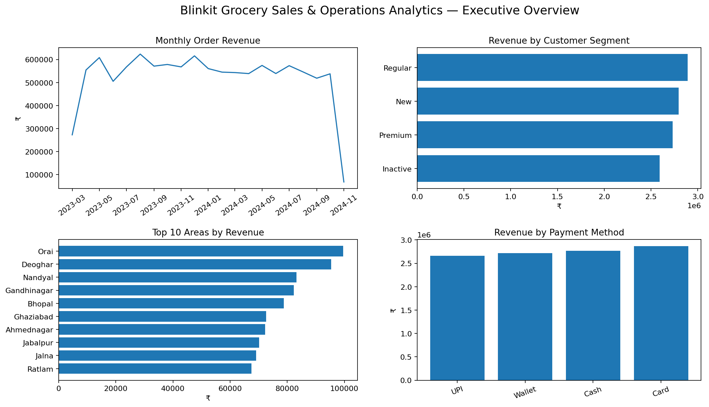
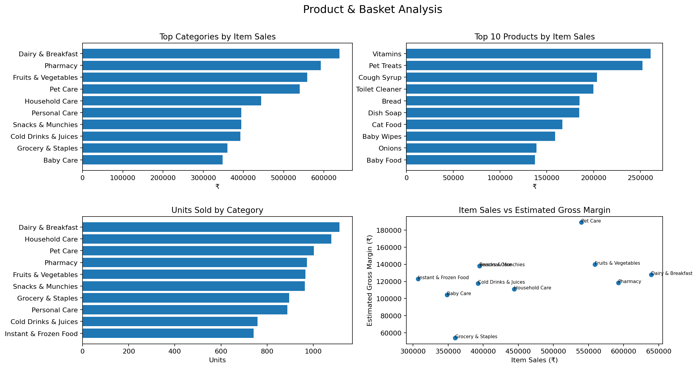
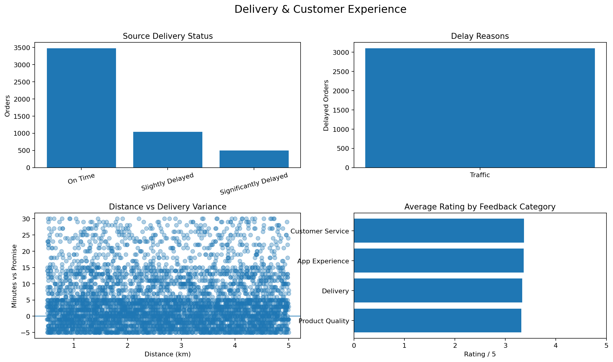
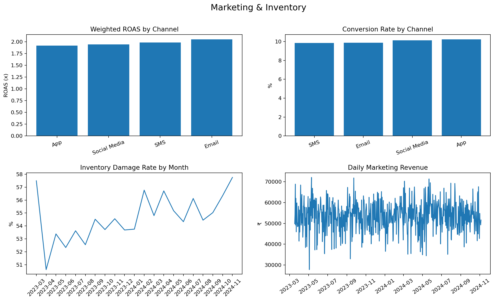

# 🛒 Blinkit Grocery Sales & Operations Analytics

> **End-to-end Data Analytics Portfolio Project | MySQL • Python • Pandas • Power BI • DAX**

An end-to-end analytics project built around a Blinkit-style grocery dataset to understand **sales performance, product/category trends, customer segments, delivery reliability, marketing efficiency, and inventory-loss signals**.

The project follows a practical analytics workflow: **data validation → Python EDA → MySQL business analysis → Power BI modeling & DAX → interactive dashboard → business recommendations**.

---

## 🎯 Business Objective

Quick-commerce businesses generate large volumes of transactional and operational data. The goal of this project is to convert that raw data into clear answers to questions such as:

- Which categories and products contribute most to sales?
- Which customer segments and areas generate stronger order revenue?
- How reliable is delivery performance?
- Which marketing channels show stronger conversion and ROAS?
- What inventory-loss signals should management investigate?

The project focuses on **descriptive and diagnostic analytics** rather than unsupported forecasting or causal claims.

---

## 📊 Dataset at a Glance

The supplied synthetic dataset contains multiple related business tables covering the customer-to-order journey and supporting operational data.

| Dataset | Purpose |
|---|---|
| `orders` | Order-level transactions, dates, totals and payment information |
| `order_items` | Product-level transaction lines, quantity and unit price |
| `products` | Product, category, brand, MRP and margin attributes |
| `customers` | Customer segment and area attributes |
| `delivery_performance` | Delivery timing and delivery-status information |
| `marketing_performance` | Campaign/channel spend, impressions, conversions and revenue |
| `inventory` | Received and damaged-stock records |
| `customer_feedback` | Ratings and customer feedback signals |

### Key data-quality decisions

The project deliberately validates the supplied data instead of assuming that every field in a typical Blinkit case-study dataset exists.

- `store_id` is unique per order in the supplied data, so it is **not treated as a reliable repeated outlet dimension**.
- Order-level `order_total` and item-level `quantity × unit_price` do not reconcile, so they are kept as **separate analytical measures**.
- The source delivery status and timestamp-derived delivery status are not perfectly aligned; both are retained and documented.
- Product `margin_percentage` is used only to calculate an **estimated margin/profit proxy**, not accounting profit.
- The GitHub-ready version uses an **anonymised customer table** rather than exposing personal customer fields.
- Marketing data is analysed separately because it does not have a reliable shared key at the order-line grain.

These decisions are documented in [`docs/source_notes.md`](docs/source_notes.md).

---

## 🔑 Key Results

| KPI / Finding | Result |
|---|---:|
| Orders | **5,000** |
| Order-level revenue | **₹1.10 Cr+** |
| Average Order Value | **₹2,201.86** |
| Customers with >1 order | **68.7%** |
| Source-labelled on-time delivery | **69.4%** |
| Highest-sales category | **Dairy & Breakfast** |
| Highest weighted marketing ROAS | **Email — ~2.05×** |
| Damaged-to-received inventory signal | **54.4%** |

> The inventory figure is treated as an **operational signal for investigation**, not as a complete inventory-optimization metric because the dataset does not contain closing stock or stock-out events.

---

## 🧰 Tech Stack

- **MySQL 8.0+** — schema design, joins, aggregations and business analysis
- **Python / Pandas** — data cleaning, validation and exploratory analysis
- **Power BI** — interactive dashboard and data visualization
- **DAX** — KPI and analytical measures
- **CSV / Excel** — source-data handling

---

## 🔄 Analytics Workflow

```text
Raw CSVs
   ↓
Python / Pandas
   ↓
Data Cleaning + Validation + EDA
   ↓
MySQL Schema + Business Queries
   ↓
Validated KPIs + Business Insights
   ↓
Power BI Data Model
   ↓
DAX Measures
   ↓
Interactive Dashboard
   ↓
Recommendations & Interview-ready Insights
```

---

# 📈 Power BI Dashboard

The dashboard is divided into **four focused pages**. Each section below explains the business purpose first and immediately shows the corresponding dashboard preview.

---

## 1️⃣ Executive Overview

### Business question
**“How is the business performing overall?”**

This page provides a management-level snapshot of the project, including:

- Total Sales
- Total Orders
- Average Order Value
- Average Sales per Item
- Average MRP
- Sales by category
- Sales by payment method
- Top areas by sales
- Sales trend over time
- Interactive slicers for key business dimensions

### Dashboard Preview



*Executive Overview — high-level KPIs, sales mix and trend analysis.*

---

## 2️⃣ Product & Basket Analysis

### Business question
**“Which products and categories drive sales?”**

This page focuses on product-level performance and basket behaviour through:

- Top categories by item-level revenue
- Brand performance
- Unit price vs. quantity relationship
- Average MRP by category
- Category revenue and estimated margin/profit proxy

The price-vs-quantity relationship was validated during Python analysis; the observed correlation is approximately **0.02**, indicating essentially no linear relationship in this dataset.

### Dashboard Preview



*Product & Basket Analysis — category, brand, pricing and basket-level analysis.*

---

## 3️⃣ Delivery & Customer Experience

### Business question
**“How reliable is delivery and what does customer feedback indicate?”**

This page brings together operational and customer-experience signals, including:

- On-time vs. delayed delivery
- Delivery performance patterns
- Customer segment comparisons
- Customer feedback and rating signals
- Area-level performance where meaningful

### Dashboard Preview



*Delivery & Customer Experience — delivery reliability and customer-facing operational signals.*

---

## 4️⃣ Marketing & Inventory

### Business question
**“Which marketing channels perform efficiently, and what inventory-loss signals need attention?”**

This page combines two supporting business areas:

- Marketing spend and revenue
- Conversion performance
- Channel-level ROAS
- Inventory received vs. damaged stock
- Operational signals requiring further investigation

### Dashboard Preview



*Marketing & Inventory — campaign efficiency and inventory-loss monitoring.*

---

## 🧠 Data Model

The core Power BI model follows a simple **star-style analytical structure**:

```text
                  PRODUCTS
                     │
                     │ 1 → many
                     ▼
                ORDER_ITEMS
                     ▲
                     │ many ← 1
                     │
                   ORDERS
                     ▲
                     │ many ← 1
                     │
                 CUSTOMERS
```

### Why `order_items` is the fact table

`order_items` represents the most detailed transactional grain: **one row = one product line within an order**. This allows product-level calculations such as:

```text
Line Revenue = Quantity × Unit Price
```

The model uses **1-to-many, single-direction relationships** to keep filtering predictable and avoid ambiguous paths.

The complete model documentation is available in [`powerbi/data_model.md`](powerbi/data_model.md).

---

## 🧮 Key DAX Measures

Examples of the core measures used in the dashboard:

```DAX
Total Sales = SUM(orders[order_total])
```

```DAX
Total Orders = DISTINCTCOUNT(orders[order_id])
```

```DAX
Average Order Value =
DIVIDE([Total Sales], [Total Orders])
```

```DAX
Line Revenue =
SUMX(
    order_items,
    order_items[quantity] * order_items[unit_price]
)
```

The project uses `DIVIDE()` for safe ratio calculations and `SUMX()` where a value must be calculated row-by-row before aggregation.

See the complete measure list in [`powerbi/DAX_measures.dax`](powerbi/DAX_measures.dax).

---

## 🗄️ SQL Analysis

The SQL layer answers business questions around:

- Overall sales and order KPIs
- Category and product performance
- Customer-segment performance
- Area-level sales
- Delivery and operational performance
- Marketing performance
- Inventory-loss signals
- Data-quality validation

SQL files are organised in [`sql/`](sql/), starting with the schema and followed by focused analysis scripts.

---

## 🐍 Python Analysis

Python/Pandas was used for:

1. Loading and inspecting the supplied tables
2. Checking data types and missing values
3. Detecting duplicates and structural issues
4. Validating relationships and cardinality
5. Performing exploratory analysis
6. Calculating supporting statistics and correlations
7. Producing analytical outputs used to support the dashboard and business insights

Run the analysis with:

```bash
pip install -r requirements.txt
python python/analysis.py
```

The analysis writes KPI and supporting tables to `reports/`.

---

## 📁 Repository Structure

```text
blinkit-grocery-sales-analytics/
│
├── README.md
├── 01_executive_overview.png
├── 02_product_basket_analysis.png
├── 03_delivery_customer_experience.png
├── 04_marketing_inventory.png
│
├── data/
│   ├── raw/
│   └── processed/
│
├── sql/
│   ├── 00_schema.sql
│   ├── 01_data_quality.sql
│   ├── 02_sales_analysis.sql
│   ├── 03_product_analysis.sql
│   ├── 04_customer_analysis.sql
│   ├── 05_operations_analysis.sql
│   └── 06_business_insights.sql
│
├── python/
│   ├── analysis.py
│   └── blinkit_analysis.ipynb
│
├── powerbi/
│   ├── DAX_measures.dax
│   ├── data_model.md
│   ├── dashboard_build_guide.md
│   └── README.md
│
├── reports/
├── docs/
├── tests/
├── requirements.txt
└── .gitignore
```

---

## 🚀 Running the Project

### Python

```bash
pip install -r requirements.txt
python python/analysis.py
```

### MySQL

1. Install MySQL 8.0+.
2. Run `sql/00_schema.sql`.
3. Load the supplied CSV tables into the matching tables.
4. Run the analysis scripts in `sql/`.

### Power BI

The repository contains the cleaned Power BI-ready tables, data-model documentation, DAX measures and dashboard build guide.

> 
---

## 💡 Key Business Takeaways

- High-performing product categories deserve closer attention for assortment and availability planning.
- Delivery reliability should be monitored alongside sales growth because operational issues can directly affect customer experience.
- Marketing channels should be evaluated using conversion and ROAS rather than reach alone.
- The inventory damage signal warrants operational investigation, but additional stock-on-hand data would be required before recommending a complete inventory-optimization strategy.
- Data validation is essential: business conclusions should be based on fields and relationships that the dataset can genuinely support.

---

## 👤 Project Author

**Vedang Mishra**

---
